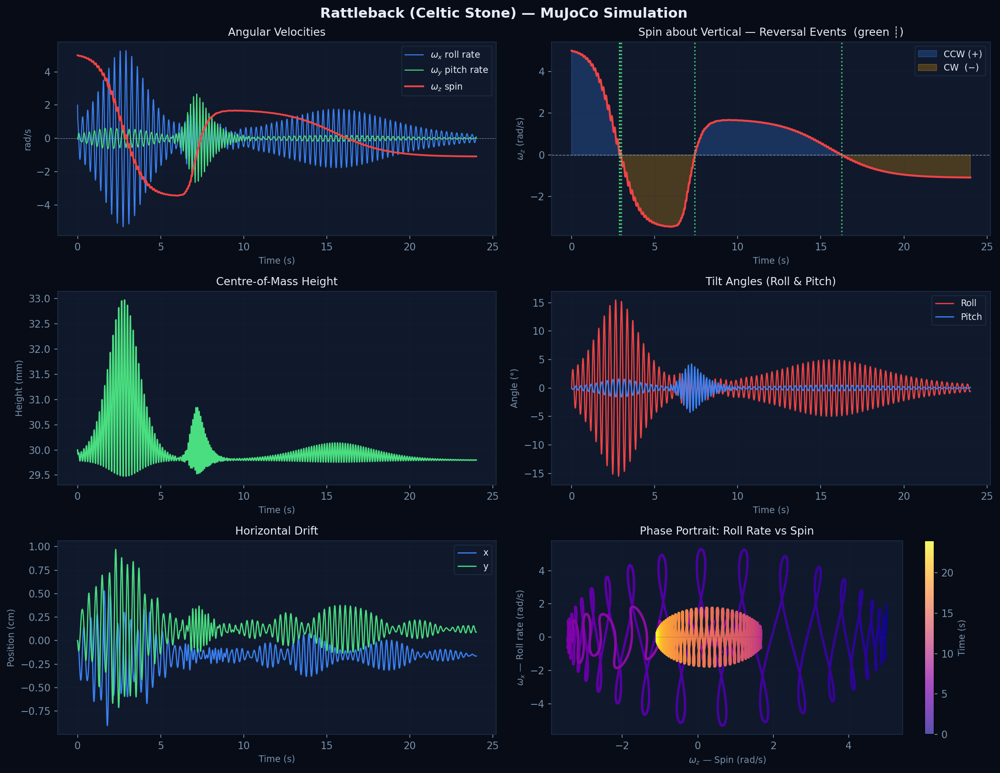

# Rattleback (Celtic Stone) simulation — MuJoCo + Python.
The rattleback is an ellipsoidal body whose inertia principal axes are tilted 20° relative to its geometric symmetry axes.  
When spun in the "wrong" direction that tilt creates a gyroscopic coupling between the spin mode and the rocking (pitching / rolling) modes; the stone rocks, slows, and spontaneously reverses its spin direction.

Outputs (written to the same directory as this script):
  - `rattleback_sim.mp4` — rendered 3-D simulation video
  - `rattleback_states.png` — time-series and phase-portrait plots

Usage:
```bash
  python rattleback_sim.py
```

Override the OpenGL backend if EGL is unavailable:
```bash
  MUJOCO_GL=osmesa python rattleback_sim.py
```

## XML Specifications

### Geometry
The simulated rattleback is a solid ellipsoid, semi-axes a=0.12 m (long), b=0.06 m (wide), c=0.03 m (tall).  
Resting contact point is the bottom of the ellipsoid; body origin placed at z = c so the stone just touches the ground plane at t = 0.

### Inertia
Diagonal values for a uniform solid ellipsoid

$$
I_x = m(b^2+c^2)/5 = 0.5 \cdot (0.0036+0.0009)/5 = 4.50 \times 10^{-4}~\text{kg·m}^2
$$

$$
I_y = m(a^2+c^2)/5 = 0.5 \cdot (0.0144+0.0009)/5 = 1.53 \times 10^{-3}~\text{kg·m}^2
$$

$$
I_z = m(a^2+b^2)/5 = 0.5 \cdot (0.0144+0.0036)/5 = 1.80 \times 10^{-3}~\text{kg·m}^2
$$

### Asymmetry
The inertia principal frame is rotated 20° about the body z-axis relative to the geometric symmetry axes.  
This creates off-diagonal inertia coupling 
$$
I_{xy} = \frac{I_y-I_x}{2} \cdot \sin(2 \cdot 20°)
$$
which drives gyroscopic spin reversal (the Celtic-stone effect).

## Results

[](https://www.youtube.com/watch?v=TjvpU8pFmmM)

*(click the thumbnail to watch the simulation on YouTube)*


